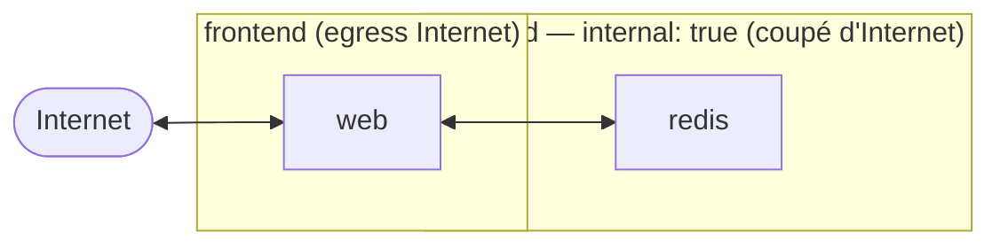

# 03 — Compose : bonnes pratiques, durcissement & secrets

> **Format.** Ce guide vous accompagne pour **construire une stack Compose plus robuste**, à
> partir de celle du `02`, étape par étape. Il comporte des **parties à compléter par vous-même**
> (`# TODO`) — pour valider la compréhension et vous faire consulter la documentation. La
> correction complète est dans [`solution/`](solution/), à ne regarder qu'en cas de blocage 😉.

## ✨ Objectifs

- Durcir une stack Compose (réseaux, ressources, sécurité, robustesse).
- Séparer `compose.yaml` et `infra.yaml` avec **`include:`**.
- Ajouter un **override de prod** (`compose.prod.yaml`).
- Gérer les **secrets** en 3 niveaux : **Compose `secrets:`** => **Ansible Vault** (via conteneur)
  => **HashiCorp Vault** (un vrai serveur local).

## 📁 Point de départ — créer le dossier `03` depuis le `02`

À la fin du **02** (quickstart Compose), vous aviez déjà la stack Flask (`web`) + `redis`,
**scindée en deux fichiers** (`compose.yaml` qui **inclut** `infra.yaml` — voir l'étape
[*Structure your project with multiple Compose files*](https://docs.docker.com/compose/gettingstarted/#step-6-structure-your-project-with-multiple-compose-files)).

🚧 **À vous de jouer :** créez le dossier `03-better-compose/` en **repartant de votre dossier
`02`**. Exemple de commandes :

```bash
mkdir -p 03-better-compose && cd 03-better-compose
# copier depuis votre dossier 02 :
cp ../02-compose-quickstart/{app.py,requirements.txt,Dockerfile,.dockerignore} .
cp ../02-compose-quickstart/compose-app.yaml   compose.yaml      # -> renommer
cp ../02-compose-quickstart/compose-infra.yaml infra.yaml        # -> renommer
```

Pour suivre ce guide, on vous fournit en plus (déjà dans le dossier) :

```
03-better-compose/
├── secrets/redis_password.txt.sample   # gabarit de secret (§6)
├── vault-hashicorp/compose.yaml        # un Vault prêt à démarrer (§8)
├── registry-ui/compose.yaml            # registre local + UI (BONUS §10)
├── BONUS.md                            # SAST + scan + signature (supply chain)
└── solution/                           # la correction (en dernier recours)
```

Voici l'arborescence finale attendue :

```
03-better-compose/
├── app.py  requirements.txt  Dockerfile  .dockerignore   # l'app (copiée du 02, Dockerfile durci en §3)
├── compose.yaml          # web (durci) + include: infra.yaml
├── infra.yaml            # redis (durci)
├── compose.prod.yaml     # override de prod (§5)
├── .env
├── secrets/
│   ├── redis_password.txt.sample
│   └── redis_password.txt          # créé en §6 (gitignoré)
├── vault-hashicorp/compose.yaml    # HashiCorp Vault (§8)
├── registry-ui/compose.yaml        # registre local + UI (BONUS §10)
├── BONUS.md                        # supply chain : SAST, scan, signature
└── solution/                       # la correction
```

Vérifiez que la stack du `02` démarre, puis on la **durcit** section par section :

```bash
cp .env.example .env
docker compose up --build        # compose.yaml inclut infra.yaml
curl 127.0.0.1:8000              # ça marche — mais c'est "brut", on va l'améliorer
```

---

## 🕸️ §1 — Réseaux segmentés

Plutôt que le réseau `default`, on crée **deux réseaux nommés** :

- **`frontend`** : pour `web` (accès Internet sortant) ;
- **`backend`** marqué **`internal: true`** : pour `redis` => aucun accès Internet, mais
  joignable par `web`.



`web` est sur **les deux** réseaux (il sort sur Internet *et* parle à redis) ; `redis` est
**uniquement** sur `backend` => injoignable depuis l'extérieur.

🚧 **À faire :**
- mettre `redis` **uniquement** sur `backend` (dans **`infra.yaml`**) ;
- mettre `web` sur `frontend` **et** `backend` (dans **`compose.yaml`**) ;
- **déclarer les réseaux** dans une section `networks:` (en bas du fichier qui les utilise — vous
  pouvez les déclarer dans `compose.yaml`, l'`include:` les rend visibles aux deux).

```yaml
# section networks: — à compléter
networks:
  frontend:
    name: frontend          # NOM explicite (sinon Compose préfixe : "<projet>_frontend")
    # external: false       # false (défaut) = Compose CRÉE le réseau ; true = réseau déjà existant
  backend:
    name: backend
    internal: true          # PAS d'accès Internet (pas de gateway) — sécurité
    # TODO : créez vous-même un 3e réseau (ex. "admin") et placez-y un service d'admin (bonus)
```

> **Deux notions à ne pas confondre :**
> - **`internal: true`** = le réseau **n'a pas d'accès Internet** (intra-conteneur OK). C'est de
>   la **sécurité**.
> - **`external`** = qui **possède** le réseau : `false` (défaut) => **Compose le crée** ;
>   `true` => réseau **déjà existant** (créé ailleurs, ex. par le projet `edge/` du 04). C'est le
>   **cycle de vie**.
> - **`name:`** fixe le **nom réel** du réseau. Sans lui, Compose préfixe avec le nom du projet
>   (`03-better-compose_backend`) => utile de le fixer pour éviter les confusions et le partager.

> 📖 Doc : [Networking in Compose](https://docs.docker.com/compose/how-tos/networking/) ·
> [`internal`](https://docs.docker.com/reference/compose-file/networks/#internal)
>
> 💡 *Pourquoi ?* Redis n'a aucune raison de sortir sur Internet => surface d'attaque réduite,
> segmentation claire.

---

## 🛡️ §2 — Ressources & robustesse

Sans limites, un conteneur peut **OOM** tout l'hôte. On ajoute :

- **`deploy.resources.limits`** : `cpus`, `memory`, et **`pids`** (anti fork-bomb).
- **`restart: unless-stopped`**, image redis **épinglée**, **persistance**, **logs plafonnés**.

🚧 **À compléter (sur `web` et `redis`) :**

```yaml
    restart: unless-stopped
    deploy:
      resources:
        limits:
          cpus: "1.0"
          memory: 512M
          pids: 200          # /!\ mettre pids ICI, pas un `pids_limit:` au niveau du service
    logging:
      driver: json-file
      options: { max-size: "10m", max-file: "3" }
```

> **Comment choisir `pids` ?** Attention : `pids` limite le **nombre total de processus +
> threads** du conteneur, **pas** le nombre d'instances de l'app. Même une app « mono-process »
> en lance plusieurs (process maître + threads + workers) => **ne mettez pas `1`**, ça plante tout.
> Méthode : mesurez la valeur réelle, puis ajoutez une marge.
> ```bash
> docker compose exec web sh -c 'ls /proc | grep -c "^[0-9]"'   # nb de process actuels
> ```
> Une appli web typique tourne avec ~10–50 processus => un plafond de **128/256** est confortable.
> Le but n'est pas d'être au plus juste, mais de **borner** (anti fork-bomb) : on évite qu'un
> conteneur compromis crée des milliers de process et asphyxie l'hôte.

### Et pour `redis`

**1) Épingler l'image.** Au lieu du tag flottant `redis:alpine`, on fige une **version
précise** : `image: redis:XX-alpineYY` (ex. `redis:7.4-alpine`).
🚧 *À vous :* trouvez une image correspondante sur le **[Docker Hub](https://hub.docker.com/_/redis)**
(idéalement, épinglez aussi par **digest** `@sha256:…` pour une reproductibilité totale).

> *Pourquoi ?* `redis:alpine` peut pointer demain sur une autre version (mise à jour silencieuse) =>
> comportement non reproductible. Une version figée = même image partout, builds déterministes.

**2) Personnaliser la commande de lancement.** Par défaut, Redis ne **persiste** pas ses données
sur disque. On le configure via la propriété **`command:`** du service, en ajoutant des options
à `redis-server` :

| Option | Rôle |
|---|---|
| `--appendonly yes` | active l'**AOF** : chaque écriture est journalisée => données récupérables au redémarrage (opération propre à l'éditeur / la solution Redis)|
| `--save 60 1` | **snapshot RDB** : sauvegarde si ≥ 1 clé a changé en 60 s (complément de l'AOF - opération propre à l'éditeur / la solution Redis) |

🚧 *À compléter* (service `redis`, dans `infra.yaml`) :

```yaml
    command: ["redis-server", "--appendonly", "yes", "--save", "60", "1"]
    # le volume redis-data:/data conserve ces données entre les redémarrages
```

> 📖 [Redis — persistence](https://redis.io/docs/latest/operate/oss_and_stack/management/persistence/) ·
> [image redis (Docker Hub)](https://hub.docker.com/_/redis)

> 📖 [`deploy.resources`](https://docs.docker.com/reference/compose-file/deploy/#resources) ·
> [logging](https://docs.docker.com/engine/logging/configure/)
>
> ⚠️ En Compose v2, **seules** `deploy.resources.limits` sont honorées par `docker compose up`
> (pas `replicas`/`reservations.cpus`, qui restent Swarm-only). Et `pids` va **dans `limits`**
> (un `pids_limit:` au même niveau que `deploy` provoque une erreur *"distinct values"*).

---

## 🔒 §3 — Sécurité & non-root

Par défaut, un conteneur tourne **en root** et avec des permissions larges. On peut réduire la surface
d'attaque avec quatre réglages.

| Réglage | Où | Rôle |
|---|---|---|
| `security_opt: ["no-new-privileges:true"]` | les **2** services | empêche un process d'**élever ses privilèges** en cours d'exécution (via un binaire *setuid* — cf. [GTFOBins](https://gtfobins.github.io/), qui recense ces binaires détournables) |
| port lié à `127.0.0.1` | service `web` | n'écoute **que** sur la machine locale, pas sur `0.0.0.0` (toutes les interfaces) |
| `init: true` | les **2** services | un **vrai PID 1** qui transmet les signaux (`SIGTERM`…) et **récupère les zombies** |
| `USER appuser` | **Dockerfile** | l'app tourne en **non-root** => si elle est compromise, l'attaquant n'est pas root |

🚧 **À compléter (compose) :**

```yaml
    security_opt:
      - no-new-privileges:true
    init: true
    # web : exposer sur la loopback uniquement
    ports:
      - "127.0.0.1:${APP_PORT:-8000}:5000"     # <IP hôte>:<port hôte>:<port conteneur>
```

### Faire tourner l'app en non-root — deux approches

Pour ne **pas** faire tourner nos process containerisés en root, il y a deux approches possibles :

**Approche A — dans le `compose.yaml` (rapide, mais limitée).** On force un UID/GID au runtime dans le fichier docker compose:

```yaml
    user: "10001:10001"     # l'app tourne sous cet UID au lieu de root
```

C'est pratique, mais l'UID n'existe **pas forcément** dans l'image (pas de home, pas
de nom), les fichiers de l'app peuvent rester `chown root` (erreurs de permission), et un
**override** compose peut le réécrire/l'annuler.

**Approche B — dans le `Dockerfile` (recommandé).** On **crée** un vrai utilisateur, on lui donne
les bons droits, puis on bascule dessus — le non-root fait alors **partie de l'image** :

```dockerfile
# … après le COPY de l'app …
RUN adduser -D -u 10001 appuser && chown -R appuser:appuser /code
USER appuser            # tout ce qui suit (et le process final) tourne en appuser
```

> 💡 **Préférez B** : le non-root est **intrinsèque à l'image** (l'utilisateur existe vraiment,
> les fichiers lui appartiennent), c'est **reproductible partout** et ça **survit aux overrides**
> de compose. L'approche A reste un dépannage utile quand on ne peut pas rebuild l'image.

> 📖 [`USER`](https://docs.docker.com/reference/dockerfile/#user) ·
> [`user` (compose)](https://docs.docker.com/reference/compose-file/services/#user) ·
> [`security_opt`](https://docs.docker.com/reference/compose-file/services/#security_opt) ·
> [`init`](https://docs.docker.com/reference/compose-file/services/#init) ·
> [ports](https://docs.docker.com/reference/compose-file/services/#ports)
>
> 💡 **Tester le non-root :**
> ```bash
> docker compose up -d --build
> docker compose exec web whoami      # -> appuser (et non root)
> ```

---

## 🧩 §4 — `include:` — vérifier la séparation infra / app

Cette séparation, vous l'avez **déjà** mise en place au `02` :
- **`infra.yaml`** : le service `redis` (+ son volume) ;
- **`compose.yaml`** : le service `web`, qui **inclut** l'infra.

🚧 **À vérifier :** que `compose.yaml` commence bien par le bloc `include:` (si la ligne est
encore commentée depuis le `02`, **décommentez-la**) :

```yaml
include:
  - infra.yaml          # (ou: - path: ./infra.yaml)
```

> 📖 [`include`](https://docs.docker.com/reference/compose-file/include/)
>
> ```bash
> docker compose config        # vérifie que web ET redis apparaissent (l'include est résolu)
> ```
>
> 💡 *Pourquoi `include` ?* On garde l'infra (redis) et l'app (web) dans des fichiers distincts,
> mais un seul `docker compose up` orchestre les deux.

---

## 🚀 §5 — Override de prod (`compose.prod.yaml`)

En dev, on garde le confort (watch, accès large). En prod, on **durcit** — sans dupliquer toute
la conf. Compose permet d'**empiler** des fichiers : le **dernier complète/écrase** le précédent.

```bash
docker compose -f compose.yaml -f compose.prod.yaml up -d   # prod = base + override
```

On crée donc `compose.prod.yaml` qui ne contient **que les différences** de prod.

| Durcissement | Effet |
|---|---|
| `read_only: true` | le **système de fichiers racine** du conteneur passe en **lecture seule** => un attaquant ne peut rien y écrire/déposer |
| `tmpfs: [/tmp]` | une zone **inscriptible en RAM** pour les fichiers temporaires légitimes (puisque le reste est read-only) |
| `cap_drop: [ALL]` | **retire toutes** les capabilities Linux ; on **rajoute** ensuite uniquement celles nécessaires (`cap_add`) |

🚧 **À compléter (`compose.prod.yaml`) :**

```yaml
services:
  web:
    read_only: true
    tmpfs:
      - /tmp
    # … (voir le piège 1 ci-dessous)

  redis:
    read_only: true
    tmpfs:
      - /tmp
    cap_drop:
      - ALL
    # … (voir le piège 2 ci-dessous)
```

⚠️ **Deux pièges classiques (et comment les régler)**

Ce durcissement déclenche deux erreurs fréquentes. Pas d'inquiétude : on vous explique le
**symptôme**, la **cause**, puis le **correctif**.

**Piège 1 — le `develop.watch` du `web` ne marche plus.**
- *Symptôme :* au lancement, une erreur du type *"read-only file system"* sur `/code`.
- *Cause :* le `watch` (hérité de `compose.yaml`) **écrit** dans `/code` pour synchroniser le code…
  mais `read_only: true` rend le rootfs **non inscriptible**. Or le `watch` ne sert **qu'en dev** :
  en prod, il n'a aucune raison d'exister.
- *Correctif :* on **annule** la clé héritée dans l'override, avec le tag YAML `!reset` :

  ```yaml
    web:
      read_only: true
      tmpfs: [/tmp]
      develop: !reset null      # neutralise le watch hérité de compose.yaml (prod only)
  ```

**Piège 2 — Redis redémarre en boucle après `cap_drop: [ALL]`.**
- *Symptôme :* `redis` reste en `Restarting` (`docker compose ps`) ; les logs affichent
  `Can't open or create append-only dir appendonlydir: Permission denied`.
- *Cause :* en §6 on donnera à redis un **`command:` personnalisé** (pour lire le mot de passe).
  Ce `command:` **court-circuite l'entrypoint** de l'image, donc le `gosu redis` habituel
  **n'a pas lieu** : le process tournerait alors en **root**. Or `cap_drop: [ALL]` retire
  **`DAC_OVERRIDE`** — la capability qui permet à root d'ignorer les permissions de fichiers.
  Sans elle, root ne peut **pas** écrire dans `/data`, qui appartient à l'utilisateur `redis`
  (uid 999) dans l'image.
- *Correctif (propre) :* plutôt que de rendre des caps à root, on **tourne directement comme
  l'utilisateur `redis`** — le propriétaire de `/data`. Aucun `cap_add` n'est alors nécessaire :

  ```yaml
    redis:
      user: redis             # tourne comme l'uid propriétaire de /data (pas root)
      read_only: true
      tmpfs: [/tmp]
      cap_drop: [ALL]         # rien à rajouter : on n'a plus de bascule root->redis à faire
  ```

> 💡 *Et si on gardait redis en root ?* Alors il faudrait `cap_add: [DAC_OVERRIDE]` (pour écrire
> dans `/data`). Mais `user: redis` est **plus propre** : least-privilege, pas de root du tout.

> 📖 [`read_only`](https://docs.docker.com/reference/compose-file/services/#read_only) ·
> [`user`](https://docs.docker.com/reference/compose-file/services/#user) ·
> [`cap_drop` / `cap_add`](https://docs.docker.com/reference/compose-file/services/#cap_add) ·
> [réinitialiser une valeur (`!reset`)](https://docs.docker.com/compose/how-tos/multiple-compose-files/merge/#reset-value)
>
> 💡 **Tester :** `docker compose -f compose.yaml -f compose.prod.yaml up -d` doit démarrer
> **les deux** services. Si `redis` redémarre en boucle (`docker compose ps`), regardez ses logs
> (`docker compose logs redis`) : *Permission denied* sur `/data` => il manque le `user: redis`.

---

## 🔑 §6 — Secrets niveau 1 : Compose `secrets:`

**Où en est-on ?** Jusqu'ici, nos valeurs sensibles vivent **en clair** dans des fichiers `.env`.
Le `.gitignore` les **garde hors de Git**, c'est déjà bien — mais ça ne suffit pas :
- le fichier `.env` reste en clair sur le disque, lisible par tout process/utilisateur de l'hôte ;
- une variable d'env injectée dans le conteneur **fuit** un peu partout (voir ci-dessous) ;
- rien n'est chiffré ni partageable proprement avec l'équipe.

On va donc **monter en gamme** sur 3 niveaux (§6 → §7 → §8). On commence par le plus simple :
les **secrets natifs de Compose**.

**Pourquoi pas une variable d'environnement ?** Un mot de passe passé en `environment:` est
visible par **n'importe qui** sur l'hôte : `docker inspect`, `docker compose config`, `/proc`,
les logs… Compose `secrets:` monte plutôt le mot de passe comme un **fichier** dans
`/run/secrets/<nom>` (un `tmpfs`, en RAM, jamais dans l'image), que le service lit à la demande.

| Élément | Rôle |
|---|---|
| bloc `secrets:` (haut du fichier) | **déclare** le secret et **d'où** il vient (`file:` = fichier local) |
| `secrets: [redis_password]` (dans le service) | **monte** le secret dans CE service => `/run/secrets/redis_password` |
| le fichier `secrets/redis_password.txt` | le **clair**, **gitignoré** (seul le `.sample` est commité) |

🚧 **À compléter (dans `compose.prod.yaml`) :**

```yaml
services:
  redis:
    # Redis n'a PAS d'option "--requirepass-file" : il attend le mot de passe EN CLAIR
    # sur la ligne de commande. On le lit donc depuis le fichier secret via un shell.
    command:
      - sh
      - -c
      - 'redis-server --appendonly yes --requirepass "$$(cat /run/secrets/redis_password)"'
    secrets: [redis_password]

secrets:
  redis_password:
    file: ./secrets/redis_password.txt   # fichier réel (gitignoré) ; .sample fourni
```

> **Le détail qui piège — `$$` :** dans un fichier Compose, `$` sert à l'**interpolation de
> variables** (`${APP_PORT}`). Pour passer un **vrai `$`** au shell du conteneur (ici `$(cat …)`),
> on l'**échappe en `$$`**. Sans ça, Compose tenterait d'interpréter `$(cat …)` au lancement => le
> secret ne serait jamais lu.

### ⚠️ Et côté app ? 

On a protégé **le serveur** Redis… mais **le client** — notre app Flask — ne connaît pas encore le
mot de passe ! Tel quel, le `cache.incr("hits")` échouera avec **`NOAUTH Authentication
required`**. Il faut donc **aussi** donner le secret à `web` et l'utiliser dans le code.

**1) Monter le même secret dans `web`** (dans `compose.yaml` ou l'override) :

```yaml
services:
  web:
    secrets: [redis_password]      # -> /run/secrets/redis_password (lisible par l'app)
```

**2) Modifier `app.py`** pour lire le secret et le passer à la connexion Redis. L'app doit
maintenant lire le **fichier** secret (et pas une variable d'env, pour ne pas le ré-exposer), avec
un repli pratique pour le dev.

🚧 **À faire :** **remplacez intégralement** le contenu de votre fichier `app.py` par celui-ci
(la seule nouveauté par rapport au `02` est la fonction `_redis_password()` et l'argument
`password=`) :

```python
import os
import redis
from flask import Flask

app = Flask(__name__)


def _redis_password():
    # 1) fichier secret monté par Compose (prod), 2) repli env (dev), 3) None (pas de mot de passe)
    path = os.getenv("REDIS_PASSWORD_FILE", "/run/secrets/redis_password")
    if os.path.exists(path):
        return open(path).read().strip()
    return os.getenv("REDIS_PASSWORD")


cache = redis.Redis(
    host=os.getenv("REDIS_HOST", "redis"),
    port=int(os.getenv("REDIS_PORT", "6379")),
    password=_redis_password(),      # <-- la pièce manquante (lu depuis le secret)
)


@app.route("/")
def hello():
    count = cache.incr("hits")
    return f"Hello Hello me from Docker! I have been seen {count} time(s)!!!\n"
```

**3) Adapter le healthcheck de `redis`** (sinon `web` ne démarre jamais). Le healthcheck du base
`infra.yaml` est `redis-cli ping` — **sans mot de passe**. Dès que Redis en exige un, ce ping
répond **`NOAUTH`**, donc redis n'est **jamais** `healthy`, et `web` (qui attend
`depends_on: condition: service_healthy`) **reste bloqué**. 🚧 **À faire** : surchargez le
healthcheck dans l'override avec un ping **authentifié** :

```yaml
services:
  redis:
    healthcheck:
      test: ["CMD-SHELL", 'redis-cli -a "$$(cat /run/secrets/redis_password)" ping | grep -q PONG']
```

> ⚠️ Là encore, le **`$$`** échappe le `$` pour Compose (cf. l'encart plus haut).

> 💡 *Pourquoi lire le fichier et pas une variable d'env ?* Mettre le mot de passe dans
> `environment:` le ré-exposerait dans `docker inspect` — exactement ce qu'on cherchait à éviter.
> **En prod, c'est donc TOUJOURS le fichier secret** (`/run/secrets/redis_password`) qui fait foi.
>
> Le repli `REDIS_PASSWORD` n'est qu'un **confort de DEV** : en local, on n'a souvent pas de
> secret monté ni de mot de passe sur Redis — la variable d'env (ou `None`) évite de devoir créer
> un fichier secret juste pour lancer la stack. **Ne vous en servez pas en prod.** L'ordre de
> priorité est : **fichier secret → `REDIS_PASSWORD` (dev) → aucun mot de passe**.

> 📖 [Compose secrets](https://docs.docker.com/compose/how-tos/use-secrets/) ·
> [interpolation `$$`](https://docs.docker.com/reference/compose-file/interpolation/) ·
> [redis-py — `password`](https://redis.readthedocs.io/en/stable/connections.html)
>
> 💡 **Tester (bout en bout) :**
> ```bash
> cp secrets/redis_password.txt.sample secrets/redis_password.txt   # créer le clair
> docker compose -f compose.yaml -f compose.prod.yaml up -d --build
>
> # le serveur exige bien un mot de passe :
> docker compose exec redis redis-cli ping          # -> (error) NOAUTH … ✅
> docker compose exec redis redis-cli -a "$(cat secrets/redis_password.txt)" ping   # -> PONG ✅
>
> # et l'app, elle, s'authentifie bien grâce au secret :
> curl 127.0.0.1:8000      # -> "Hello … seen N time(s)" (le compteur s'incrémente => auth OK ✅)
> #                           (si l'app n'avait PAS le secret => erreur 500 / NOAUTH)
> ```

---

## 🔐 §7 — Secrets niveau 2 : chiffrer le fichier avec **Ansible Vault**

**Le problème du niveau 1 :** le secret vit en clair sur le disque (`secrets/redis_password.txt`),
gitignoré — donc **hors de Git**. Comment le partager avec l'équipe?
**Ansible Vault** chiffre le fichier (AES256) => il redevient **commitable** : tout le monde l'a
dans le repo, mais seul celui qui connaît la **passphrase** peut le lire.

| Commande | Effet |
|---|---|
| `ansible-vault encrypt <fichier>` | chiffre le fichier **sur place** (devient `$ANSIBLE_VAULT;…`, **commitable**) |
| `ansible-vault view <fichier>` | affiche le **clair** sans modifier le fichier (lecture seule) |
| `ansible-vault decrypt <fichier>` | **rétablit** le clair sur le disque (juste avant `compose up`) |

On utilise Ansible **via un conteneur** (rien à installer sur le poste) :

```bash
# CHIFFRER le secret (on vous demandera une passphrase de vault)
docker run --rm -it -v "$PWD:/work" -w /work \
  quay.io/ansible/ansible-runner \
  ansible-vault encrypt secrets/redis_password.txt

cat secrets/redis_password.txt        # -> $ANSIBLE_VAULT;1.1;AES256 …  (chiffré, commitable)
```

Avant de déployer, on **déchiffre** (le `compose up` a besoin du fichier en clair) :

```bash
# DÉCHIFFRER juste avant le déploiement
docker run --rm -it -v "$PWD:/work" -w /work \
  quay.io/ansible/ansible-runner \
  ansible-vault decrypt secrets/redis_password.txt

docker compose -f compose.yaml -f compose.prod.yaml up -d
```

> 📖 [Ansible Vault — encrypting files](https://docs.ansible.com/ansible/latest/vault_guide/vault_encrypting_content.html)
>
> 💡 Astuce : `ansible-vault view secrets/redis_password.txt` affiche le clair **sans** déchiffrer
> le fichier. *(Image plus légère possible : `alpine/ansible`.)*
>
> 🚧 **À faire :** chiffrer le fichier, le **committer chiffré**, vérifier qu'il est illisible
> dans git, puis le déchiffrer pour déployer.

---

## 🏦 §8 — Secrets niveau 3 : un vrai **HashiCorp Vault** (local)

**La limite du niveau 2 :** même chiffré, le secret reste **figé dans le repo** — pas de rotation,
pas d'audit, pas de droits par personne, et la passphrase circule à part. En entreprise, on
centralise les secrets dans un **serveur dédié** (Vault) : l'app les **récupère à la demande**,
on **révoque/renouvelle** sans toucher au code, et chaque accès est **tracé**.

On vous fournit un Vault **prêt à démarrer** (mode dev) dans [`vault-hashicorp/`](vault-hashicorp/).

> ⚠️ Le **mode dev** (`-dev`) garde tout **en mémoire** et déverrouillé avec un token fixe
> (`root`) : parfait pour apprendre, **jamais** pour la prod (données perdues au redémarrage).

```bash
# 1) démarrer Vault, puis charger VAULT_ADDR / VAULT_TOKEN depuis le .env
cd vault-hashicorp
cp .env.example .env             # contient VAULT_ADDR, VAULT_TOKEN, VAULT_DEV_ROOT_TOKEN_ID (dev)
docker compose up -d             # UI: http://localhost:8200
set -a; . ./.env; set +a         # exporte les variables du .env dans le shell courant
cd ..
```

> 💡 Plutôt que des `export VAULT_ADDR=… ; export VAULT_TOKEN=…` en clair dans le terminal, on
> centralise ces réglages **dev** dans `vault-hashicorp/.env` (gitignoré). `set -a; . ./.env`
> les charge d'un coup. En vrai prod, un token root ne se balade évidemment **jamais** ainsi.

🚧 **À faire :** écrire le secret dans Vault, puis le récupérer pour produire le fichier monté
par Compose.

> ℹ️ **On manipule Vault en ligne de commande** (`vault kv put`/`get`), parce que c'est le plus
> facile à scripter/automatiser. Mais ce n'est **qu'une** des portes d'entrée : le **même** Vault
> est aussi pilotable via son **interface web** (UI sur `:8200`) et son **API HTTP REST** (que la
> CLI et l'UI appellent en réalité). Choisissez l'outil selon le contexte ; le serveur, lui, est
> le même.

```bash
# 2) écrire le secret dans Vault (CLI via le conteneur)
docker exec -e VAULT_TOKEN=root vault-dev \
  vault kv put secret/myapp/redis password="un-mot-de-passe-fort"

# 3) le RÉCUPÉRER au déploiement -> fichier secret
docker exec -e VAULT_TOKEN=root vault-dev \
  vault kv get -field=password secret/myapp/redis > secrets/redis_password.txt
chmod 600 secrets/redis_password.txt

docker compose -f compose.yaml -f compose.prod.yaml up -d
rm -f secrets/redis_password.txt        # ne pas laisser traîner le clair
```

> 📖 [Vault — KV secrets](https://developer.hashicorp.com/vault/docs/secrets/kv) ·
> [Vault dev server](https://developer.hashicorp.com/vault/docs/concepts/dev-server)
>
> 💡 Ouvrez l'**UI** (`http://localhost:8200`, token `root`) et retrouvez votre secret sous
> `secret/myapp/redis`. C'est un **vrai** serveur de secrets, prenez un temps pour explorer
> l'interface !

### 📊 Comparaison de nos 3 niveaux de secrets

| | Compose `secrets:` | Ansible Vault | HashiCorp Vault |
|---|---|---|---|
| Le secret… | fichier local gitignoré | **chiffré dans le repo** | sur un **serveur** |
| Dynamique / rotation | non | non | **oui** (TTL, génération) |
| Échelle | un projet | un projet | **organisation** |

---

## 🧰 §9 — Pour aller plus loin : sécuriser la *supply chain* (BONUS)

La stack est durcie **à l'exécution**. On peut aussi sécuriser l'**image elle-même** : l'analyser
(SAST : config, secrets, vulnérabilités), la scanner, et la **signer** (Cosign / Sigstore).

👉 Tout ça est dans un fichier dédié : **[BONUS.md](BONUS.md)** — l'ordre suivi est celui d'un vrai
pipeline : **SAST (Trivy) → build → scan de l'image → signature (Cosign)**.

---

## 🎉 Récap final

- [ ] Stack durcie : réseaux segmentés, ressources limitées, non-root, healthchecks.
- [ ] `compose.yaml` + `include: infra.yaml`.
- [ ] `compose.prod.yaml` (read_only + cap, **2 pièges résolus**).
- [ ] Secret Redis via **Compose `secrets:`** (plus de mot de passe en clair dans la conf).
- [ ] Secret **chiffré avec Ansible Vault** (commit chiffré), puis déchiffré pour déployer.
- [ ] Secret **servi par HashiCorp Vault** local.
- [ ] (**[BONUS.md](BONUS.md)**) Image **analysée** (Trivy) et **signée** (Cosign).

## ✅ Bonus

- Aller plus loin : **[BONUS.md](BONUS.md)** — SAST (Trivy), scan de l'image, signature (Cosign).
- Épingler Redis par **digest** (`redis:7.4-alpine@sha256:…`).
- **Portainer** pour visualiser les conteneurs ; **Adminer** pour une éventuelle DB.
- Un `Makefile` (ou des alias) pour les commandes `up`/`down`/`prod`.
- Enchaîner sur le **[04-server-compose](../04-server-compose/)** : plusieurs projets derrière un
  edge Traefik.
