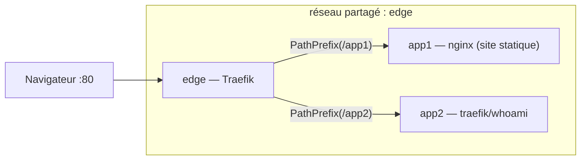

# 04 — Deux apps derrière un reverse proxy (organisation serveur)

> **Format.** Cas pratique **guidé, à construire vous-même**. On part de **zéro** : deux petites
> apps, qu'on organise comme sur un **vrai serveur** (`/srv/docker`), avec un **reverse proxy**
> unique (Traefik) qui route vers chacune. Des **parties sont à compléter** (`# TODO`, « À vous de
> jouer ») ; la correction est dans [`solution/`](solution/), à ne regarder qu'en cas de blocage 😉.

## ✨ Objectifs

- Déployer **deux applications** conteneurisées, chacune dans **son propre projet Compose**.
- Comprendre les **réseaux Docker** et le **réseau partagé** entre projets.
- Mettre en place un **reverse proxy** (**Traefik**) qui route `/app1` et `/app2`.
- Organiser le tout comme sur un **serveur** : arborescence `/srv/docker` avec un dossier `edge/`.

*(Pas de TLS/HTTPS ici — on se concentre sur l'organisation et le routage. Le HTTPS viendra après.)*

## ♻️ Schéma global



- **`edge`** = un réseau **partagé**, **créé par le projet `edge/`** et **rejoint** par app1 & app2.
- **Seul Traefik** publie un port sur l'hôte (**80**). Les apps **n'exposent rien** directement.
- Traefik **découvre** les apps via le **socket Docker** + leurs **labels**, et route par l'URL.

## 📁 Arborescence cible (à créer)

On simule un serveur : tout vit sous `srv-docker/`, **un dossier par brique** :

```
04-server-compose/
└── srv-docker/
    ├── edge/            # le reverse proxy (Traefik) — possède le port 80
    │   └── compose.yaml         # ← À VOUS
    ├── app1/            # app statique nginx
    │   ├── html/index.html      # (fourni) la page
    │   ├── Dockerfile           # (fourni) image nginx + la page
    │   └── compose.yaml         # ← À VOUS
    └── app2/            # traefik/whoami (pas de build)
        └── compose.yaml         # ← À VOUS
```

> On vous **fournit** l'app1 (page + Dockerfile). **Ce que vous allez écrire**, ce sont les **3 fichiers
> `compose.yaml`** (edge, app1, app2).

---

## 👉 Étape 1 — App1 : un site statique nginx

L'app1 est **fournie** : une page HTML servie par nginx.

- `app1/html/index.html` — la page ;
- `app1/Dockerfile` — `FROM nginx:1.27-alpine` + copie de `html/` (nginx écoute sur le **port 80**
  dans le conteneur).

🚧 **À vous de jouer :** créez `app1/compose.yaml`. Pour l'instant, **sans** reverse proxy, juste
pour vérifier que l'app tourne. Indications :

- `build: .` (Docker Compose construit l'image depuis le `Dockerfile`) ;
- un `image:` explicite (ex. `app1:local`) ;
- une redirection de port **temporaire** pour tester (ex. `8001:80`).

```yaml
services:
  app1:
    build: .
    image: app1:local
    ports:
      - "8001:80"        # TEMPORAIRE — on l'enlèvera quand Traefik sera là
```

> 💡 **Tester :** `docker compose up -d --build` puis ouvrez <http://localhost:8001> → la page App1.
> Une fois validé : `docker compose down`.

---

## 👉 Étape 2 — App2 : `traefik/whoami`

App2 n'a **rien à builder** : c'est l'image toute faite **`traefik/whoami`**, un mini service qui
**renvoie les en-têtes HTTP** qu'il reçoit (idéal pour *voir* ce qu'un reverse proxy transmet). En
interne, whoami écoute sur le **port 80**.

🚧 **À vous de jouer :** créez `app2/compose.yaml` (sur le modèle d'app1, mais **sans `build`** :
juste `image: traefik/whoami`). Testez-le avec un port temporaire (ex. `8002:80`).

> 💡 **Tester :** <http://localhost:8002> → whoami affiche `Hostname`, `IP`, les en-têtes… `down`
> ensuite.

---

## 🧭 Étape 3 — Pourquoi un reverse proxy ?

Pour l'instant, chaque app a besoin de **son propre port** (`8001`, `8002`, …). Ça ne passe pas à l'échelle :
souvent sur un serveur, on veut **une seule porte d'entrée** (le port **80**) et router selon l'**URL**.
C'est le rôle d'un **reverse proxy**.

| Reverse proxy | En bref |
|---|---|
| **Traefik** | **découverte automatique** des conteneurs via labels Docker ; config dynamique. *(c'est cette fonctionnalité qui a orienté notre choix ici)* |
| **NGINX** | ultra-répandu, config statique dans un fichier (`nginx.conf`) ; très performant |
| **HAProxy** | orienté **load-balancing** L4/L7, très robuste en prod |
| **Caddy** | simple, **HTTPS auto** par défaut |
| ... | ... |

👉 On prend **Traefik** parce qu'il **lit les labels** de nos conteneurs : pas de fichier de conf à
maintenir, chaque app **déclare elle-même** sa route (on est un peu dans l'inversion de contrôle). Cela semble plus simple et évolutif pour ajouter des applications à long terme (le socle infra/edge ne bouge pas).

---

## ⛩️ Étape 4 — La partie edge : le reverse proxy Traefik

On crée le projet `edge/` : c'est **lui** qui possède le port **80** et le **réseau partagé**.

🚧 **À compléter :** créez `edge/compose.yaml` et réalisez la config Traefik. 
Indications sur la config Traefik (mode `command:`) :

- `--providers.docker=true` : Traefik lit les conteneurs Docker ;
- `--providers.docker.exposedbydefault=false` : **rien** n'est exposé sans `traefik.enable=true` ;
- `--entrypoints.web.address=:80` : le point d'entrée HTTP ;
- `--api.dashboard=true --api.insecure=true` : le **dashboard** Traefik (DEV) ;
- monter le **socket Docker en lecture seule** : `/var/run/docker.sock:/var/run/docker.sock:ro` ;
- publier `80:80` (apps) et `127.0.0.1:8080:8080` (dashboard, en loopback) ;
- déclarer le réseau **`edge`** avec un **`name:` explicite** (il sera `external` côté apps).

```yaml
services:
  traefik:
    image: traefik:v3.1
    command:
      - --providers.docker=true
      - --providers.docker.exposedbydefault=false
      - --entrypoints.web.address=:80
      # TODO : dashboard (--api.dashboard=true --api.insecure=true)
    ports:
      - "80:80"
      # TODO : dashboard sur 127.0.0.1:8080:8080
    volumes:
      - /var/run/docker.sock:/var/run/docker.sock:ro
    networks: [edge]

networks:
  edge:
    name: edge        # réseau PARTAGÉ, créé ICI
```

> 💡 **Tester :** `cd edge && docker compose up -d`, puis le **dashboard** sur
> <http://localhost:8080> → Traefik tourne (encore aucune route, c'est normal).

---

## 🔌 Étape 5 — Brancher les apps sur l'edge (labels + réseau)

Chaque app doit maintenant : (1) **rejoindre** le réseau `edge`, (2) **déclarer sa route** via des
**labels** Traefik — et on **retire les ports temporaires** (`8001`/`8002`) : plus personne
n'expose de port sauf l'edge.

🚧 **À compléter** dans **`app1/compose.yaml`** (idem app2 en adaptant les noms) :

```yaml
services:
  app1:
    build: .
    image: app1:local
    # (plus de ports: ! l'accès passe par Traefik)
    networks: [edge]
    labels:
      - traefik.enable=true                                     # opt-in
      - traefik.http.routers.app1.rule=PathPrefix(`/app1`)      # route /app1
      # /app1/xyz -> /xyz côté app : on retire le préfixe (middleware stripprefix)
      - traefik.http.routers.app1.middlewares=app1-strip
      - traefik.http.middlewares.app1-strip.stripprefix.prefixes=/app1
      - traefik.http.services.app1.loadbalancer.server.port=80  # port INTERNE du conteneur
      - traefik.docker.network=edge                             # réseau à utiliser par Traefik

networks:
  edge:
    name: edge
    external: true       # le réseau est créé par le projet edge/, pas par ce projet
```

> **Deux subtilités à comprendre :**
> - **`stripprefix`** : sans lui, Traefik transmettrait `/app1` à nginx qui répondrait **404**
>   (il n'a pas de page `/app1`). On **retire** le préfixe → nginx reçoit `/`.
> - **`traefik.docker.network=edge`** : un projet a **plusieurs** réseaux possibles ; on **dit** à
>   Traefik lequel utiliser pour joindre le conteneur (sinon il peut se tromper de réseau).

🚧 **À vous :** faites la **même chose** pour **`app2`** (`PathPrefix(/app2)`, `app2-strip`, port
`80`). *App2 étant whoami, vous verrez dans sa réponse les en-têtes `X-Forwarded-*` ajoutés par
Traefik.*

---

## 🚀 Étape 6 — Démarrer toute la stack (dans l'ordre)

L'**edge en premier** (il crée le réseau `edge`), puis les apps :

```bash
cd srv-docker/edge && docker compose up -d && cd -
cd srv-docker/app1 && docker compose up -d --build && cd -
cd srv-docker/app2 && docker compose up -d && cd -
```

> 💡 **Tester le routage :**
> ```bash
> curl http://localhost/app1     # -> la page HTML d'App1 (nginx) ✅
> curl http://localhost/app2     # -> whoami : Hostname, IP, X-Forwarded-Prefix: /app2 … ✅
> ```
> Et le **dashboard** <http://localhost:8080> liste maintenant vos **routers** `app1` / `app2`.
>
> ⚠️ *Si `/app1` renvoie 404* → il manque le **stripprefix** (nginx reçoit `/app1`).
> *Si « Bad Gateway »* → mauvais **port** dans `loadbalancer.server.port` ou mauvais
> `traefik.docker.network`.

---

## 🎉 Récap final

- [ ] App1 (nginx statique) déployée, App2 (whoami) déployée.
- [ ] Un **edge Traefik** unique possède le port **80** ; les apps **n'exposent plus** de port.
- [ ] Réseau **`edge` partagé** : créé par `edge/`, rejoint en `external: true` par les apps.
- [ ] Accès via **chemins** : `/app1` et `/app2` (avec **stripprefix**).
- [ ] Le **dashboard** Traefik montre les deux routers.

## ✅ Bonus

- **Router par domaine** au lieu du chemin : `Host(\`app1.localhost\`)` (pas besoin de stripprefix).
- **HTTPS** : ajouter un entrypoint `websecure` + Let's Encrypt (challenge TLS) — cf. le pattern de
  production (`edge/` avec `acme.json` en `chmod 600`).
- Ajouter une **3ᵉ app** en 2 minutes : nouveau dossier, `image:` + labels, `up`. C'est tout
  l'intérêt du pattern.
- **Portainer** pour visualiser les conteneurs ; un **`Makefile`** pour les `up`/`down` en série ou un **`compose.yaml` parent** avec **`include:`** pour orchestrer les 3 projets d'un seul `up`.

---

## Remarques finales

- Pattern serveur = **un edge (reverse proxy) + N projets** branchés via un **réseau partagé** et
  des **labels**.
- Les apps **n'exposent rien** ; l'edge route par **URL** (`PathPrefix` ou `Host`).
- Traefik **découvre** les services (socket Docker `:ro`) et se configure via leurs **labels** —
  ajouter une app = ajouter un dossier, pas toucher au proxy.
- **Alternatives** au même rôle : NGINX, HAProxy, Caddy.
